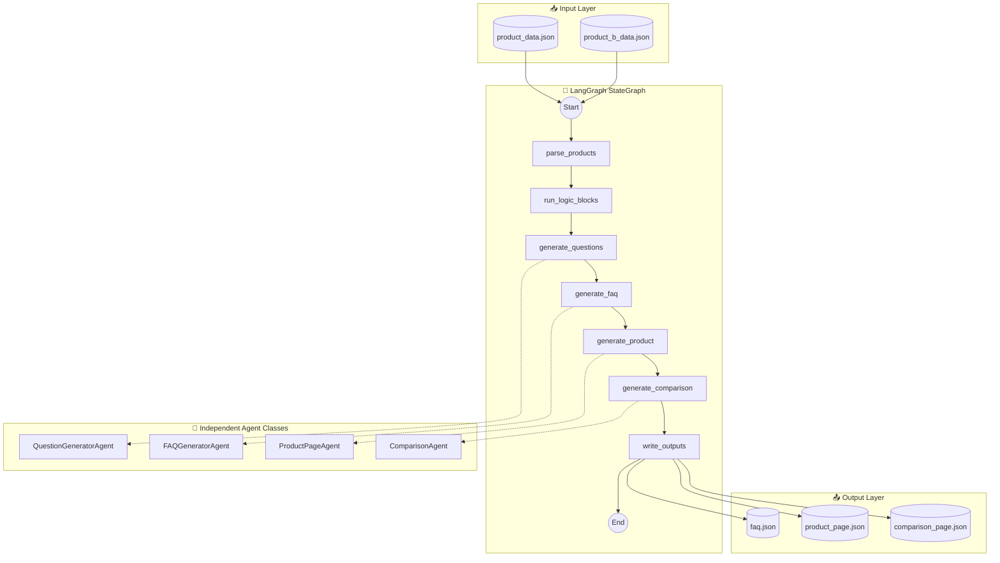

# Multi-Agent Content Generation System

[](https://langchain-ai.github.io/langgraph/)
[](https://python.org)
[](https://fastapi.tiangolo.com/)

A production-grade, **LangGraph-powered** multi-agent system that takes product datasets and autonomously generates structured, machine-readable content pages using **real LLM API calls**.

**Built by [Saad Ilkal](https://github.com/Fatal777)**

---

## 🎯 Objective

Design and implement a **LangGraph StateGraph** multi-agent system with **independent agents** that:
- Uses **real LLM calls** (Ollama/Gemini/OpenAI) for content generation
- Orchestrates agents via **DAG-based state machine**
- Each agent is **independent** with its own LLM instance
- Generates 21+ categorized user questions via LLM
- Assembles 3 content pages (FAQ, Product, Comparison)
- Outputs strict JSON (no hardcoded content)

---

## 🏗️ System Architecture

### LangGraph StateGraph Pipeline



### Key Features

| Feature | Implementation |
|---------|----------------|
| **Framework** | LangGraph StateGraph |
| **LLM Providers** | Ollama (free local), Gemini, OpenAI |
| **Independent Agents** | Each agent has own LLM instance |
| **State Management** | TypedDict with Annotated fields |
| **Output Parsing** | LangChain JsonOutputParser |

---

## 📁 Project Structure

```
kasparro-agentic/
├── agents/                      # LangGraph agents
│   ├── graph.py                 # LangGraph StateGraph (entry point)
│   ├── llm_agents.py            # Independent agent classes
│   └── nodes.py                 # Node functions for graph
│
├── core/                        # Infrastructure
│   ├── graph_state.py           # TypedDict state definition
│   ├── llm_factory.py           # Multi-provider LLM factory
│   └── schemas.py               # Pydantic output schemas
│
├── logic_blocks/                # Pure function transformations
│   ├── benefits_block.py
│   ├── usage_block.py
│   └── comparison_block.py
│
├── api/                         # FastAPI REST API
│   └── main.py
│
├── frontend/                    # Web UI
│   ├── index.html
│   ├── styles.css
│   └── app.js
│
├── data/                        # Input data
│   ├── product_data.json
│   └── product_b_data.json
│
├── output/                      # LLM-generated outputs
│   ├── faq.json
│   ├── product_page.json
│   └── comparison_page.json
│
├── tests/                       # Pytest test suite
│   └── test_graph.py
│
├── pyproject.toml               # Python package config
└── requirements.txt             # Dependencies
```

---

## 🚀 Quick Start

### 1. Installation

```bash
# Clone the repository
git clone https://github.com/Fatal777/kasparro-agentic.git
cd kasparro-agentic

# Install dependencies
pip install -r requirements.txt

# Or install as package
pip install -e .
```

### 2. Install Ollama (FREE Local LLM - Recommended)

> ⚠️ **Ollama must be installed separately** - it is not a Python package.

**Windows:**
```bash
# Download and install from:
https://ollama.com/download/windows

# After installation, open PowerShell and run:
ollama pull llama3.2
```

**macOS:**
```bash
# Using Homebrew:
brew install ollama

# Or download from:
https://ollama.com/download/mac

# Pull a model:
ollama pull llama3.2
```

**Linux:**
```bash
# One-line install:
curl -fsSL https://ollama.com/install.sh | sh

# Pull a model:
ollama pull llama3.2
```

### 3. Configure LLM Provider

```bash
# Copy environment template
cp .env.example .env

# Edit .env and set your LLM provider:
# - LLM_PROVIDER=ollama  (FREE, runs locally - no API key needed!)
# - LLM_PROVIDER=gemini  (cloud, requires GOOGLE_API_KEY)
# - LLM_PROVIDER=openai  (cloud, requires OPENAI_API_KEY)
```

### 4. Run the Pipeline

```bash
# Using Ollama (FREE local LLM)
python -m agents.graph

# Or start the FastAPI server
uvicorn api.main:app --reload --port 8000
```

### Expected Output

```
============================================================
  Multi-Agent Content Generation System (LangGraph)
  Rate Limit Mode: Sequential with 15s delays
============================================================

[Pipeline] Starting LangGraph execution...
[Pipeline] 4 LLM calls with 15s delays = ~1 minute total

[QuestionGeneratorAgent] Starting question generation via ollama API...
[QuestionGeneratorAgent] Generated 19 questions via ollama
  ⏳ Waiting 15s to avoid rate limits...

[FAQGeneratorAgent] Starting FAQ generation via ollama API...
[FAQGeneratorAgent] Generated 19 FAQ answers via ollama
  ⏳ Waiting 15s to avoid rate limits...

[ProductPageAgent] Starting product page generation via ollama API...
[ProductPageAgent] Generated product page for GlowBoost Vitamin C Serum
  ⏳ Waiting 15s to avoid rate limits...

[ComparisonAgent] Starting product comparison via ollama API...
[ComparisonAgent] Generated comparison via ollama
  ⏳ Waiting 15s to avoid rate limits...

============================================================
  Pipeline completed successfully!
  Execution time: 145.2s
============================================================

✅ Pipeline completed successfully!

Output files:
  - faq: output/faq.json
  - product_page: output/product_page.json
  - comparison_page: output/comparison_page.json
```

---

## 🧪 Testing

```bash
# Run all tests with pytest
python -m pytest tests/ -v

# Test specific file
python -m pytest tests/test_graph.py -v
```

---

## 📊 Agent Independence

Each agent is a **self-contained class** that can run independently:

```python
from agents.llm_agents import QuestionGeneratorAgent

# Create agent (gets own LLM instance)
agent = QuestionGeneratorAgent()

# Run independently without orchestrator
result = agent.run({
    "productName": "Test Product",
    "benefits": ["Brightening"],
    "price": {"amount": 699, "currency": "INR"}
})

print(result)  # LLM-generated questions
```

| Agent | Purpose | LLM Calls |
|-------|---------|-----------|
| `QuestionGeneratorAgent` | Generate 21 categorized questions | ✅ Yes |
| `FAQGeneratorAgent` | Generate FAQ answers | ✅ Yes |
| `ProductPageAgent` | Generate product descriptions | ✅ Yes |
| `ComparisonAgent` | Generate product comparisons | ✅ Yes |

---

## 🔧 API Endpoints

| Endpoint | Method | Description |
|----------|--------|-------------|
| `/api/health` | GET | Health check |
| `/api/run-pipeline` | POST | Run LangGraph pipeline |
| `/api/outputs/faq` | GET | Get FAQ output |
| `/api/outputs/product` | GET | Get Product output |
| `/api/outputs/comparison` | GET | Get Comparison output |
| `/api/system-info` | GET | Get architecture info |

---

## 📦 Dependencies

```
# Core
pydantic>=2.5.0
pydantic-settings>=2.1.0

# LangGraph & LangChain
langgraph>=0.0.40
langchain>=0.1.0
langchain-google-genai>=2.0.0
langchain-core>=0.1.0

# API
fastapi>=0.104.0
uvicorn>=0.24.0

# Environment
python-dotenv>=1.0.0
```

---

## ☁️ Production Deployment & Scalability

### 1. Containerization (Docker)

Use the included `Dockerfile` to containerize the application:

```bash
# Build image
docker build -t kasparro-agent .

# Run container (passing env vars)
docker run -p 8000:8000 --env-file .env kasparro-agent
```

### 2. Cloud Auto-Scaling (Google Cloud Run)

This stateless architecture is ideal for Serverless platforms like Cloud Run:

```bash
# Deploy to Cloud Run (scales to 0 when idle, up to N under load)
gcloud run deploy kasparro-agent \
  --source . \
  --port 8000 \
  --allow-unauthenticated \
  --min-instances 0 \
  --max-instances 10
```

> **Scalability Note:** Cloud Run automatically scales containers based on concurrent requests.

### 3. Async Task Queue (Recommended for High Load)

Since `run_pipeline` takes ~2 minutes (due to LLM rate limits), avoid blocking the API worker:

1.  **Refactor Main Endpoint**: Convert `/api/run-pipeline` to use `FastAPI.BackgroundTasks` or **Celery**.
    ```python
    # Example Async Pattern
    @app.post("/api/run-pipeline")
    async def run_async(background_tasks: BackgroundTasks):
        job_id = uuid4()
        background_tasks.add_task(run_pipeline, job_id)
        return {"job_id": job_id, "status": "processing"}
    ```
2.  **Worker Nodes**: Separate the API (receiver) from Worker Nodes (processors) using **Redis**.
3.  **Concurrency**: Increase worker count to process multiple pipelines in parallel.

---

## 📈 Scalability Architecture

This system is designed to scale horizontally:

| Aspect | Implementation | Scalability |
|--------|---------------|-------------|
| **LLM Providers** | Multi-provider factory | ✅ Easy to add new providers |
| **Agents** | Independent self-contained classes | ✅ Easy to add new agent types |
| **Graph Nodes** | Modular LangGraph nodes | ✅ Easy to add/modify pipeline steps |
| **State** | TypedDict flows through graph | ✅ Easy to extend state fields |
| **Templates** | JSON output templates | ✅ Easy to add new content types |

**How to extend:**

1. **Add new agent**: Create class in `agents/llm_agents.py` extending `BaseAgent`
2. **Add new node**: Add function in `agents/nodes.py`, register in `agents/graph.py`
3. **Add new output**: Add state field in `core/graph_state.py`, create template
4. **Add new LLM provider**: Extend `core/llm_factory.py`

**For enterprise scale:**
- Add message queues (Redis/RabbitMQ) for async processing
- Add database storage instead of file-based outputs
- Add caching layer for repeated LLM calls
- Add monitoring (Prometheus/Grafana)

---

## 📄 License

MIT License - See [LICENSE](LICENSE) for details.
