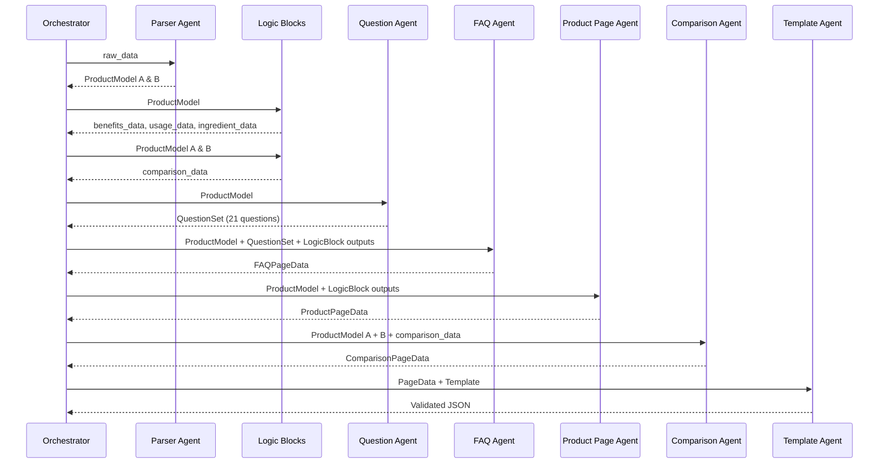

# Multi-Agent Content Generation System

A production-grade, modular agentic automation system that takes product datasets and autonomously generates structured, machine-readable content pages.

## 🎯 Objective

Design and implement a **DAG-based multi-agent system** that:
- Parses product data into clean internal models
- Generates 15+ categorized user questions
- Assembles 3 content pages (FAQ, Product, Comparison)
- Outputs strict JSON (no free text)

---

## 🏗️ System Architecture

### High-Level Overview

```mermaid
flowchart TB
    subgraph Input["📥 Input Layer"]
        PD[("product_data.json<br/>Product A")]
        PDB[("product_b_data.json<br/>Product B (Fictional)")]
    end

    subgraph Orchestrator["🎛️ Orchestrator (DAG Controller)"]
        ORCH[["orchestrator.py<br/>Controls execution order<br/>Manages message passing"]]
    end

    subgraph Agents["🤖 Agent Layer"]
        PA["Parser Agent<br/>raw → model"]
        QA["Question Agent<br/>model → 15+ questions"]
        FAQA["FAQ Agent<br/>→ Q&A pairs"]
        PPA["Product Page Agent<br/>→ product content"]
        CA["Comparison Agent<br/>→ A vs B content"]
        TA["Template Agent<br/>validate & write"]
    end

    subgraph LogicBlocks["⚙️ Logic Blocks (Pure Functions)"]
        BB["benefits_block()"]
        UB["usage_block()"]
        IB["ingredient_block()"]
        CB["comparison_block()"]
    end

    subgraph Output["📤 Output Layer"]
        FJ[("faq.json")]
        PPJ[("product_page.json")]
        CPJ[("comparison_page.json")]
    end

    PD --> ORCH
    PDB --> ORCH
    ORCH --> PA
    PA --> BB & UB & IB & CB
    PA --> QA
    BB & UB & IB --> FAQA & PPA
    CB --> CA
    QA --> FAQA
    FAQA --> TA
    PPA --> TA
    CA --> TA
    TA --> FJ & PPJ & CPJ
```



### Agent Communication Flow



---

## 📁 Project Structure

```
kasparro-agentic/
├── agents/                      # Worker agents
│   ├── orchestrator.py          # DAG controller (main entry point)
│   ├── parser_agent.py          # Converts raw data → ProductModel
│   ├── question_agent.py        # Generates 15+ categorized questions
│   ├── faq_agent.py             # Generates FAQ page content
│   ├── product_page_agent.py    # Generates product description
│   ├── comparison_agent.py      # Generates comparison page
│   └── template_agent.py        # Validates and writes JSON output
│
├── logic_blocks/                # Pure function transformations
│   ├── benefits_block.py        # Extract & structure benefits
│   ├── usage_block.py           # Parse usage instructions
│   ├── ingredient_block.py      # Extract ingredient info
│   └── comparison_block.py      # Compare two products
│
├── core/                        # Production infrastructure
│   ├── models.py                # Pydantic data models (type safety)
│   ├── config.py                # Configuration management
│   ├── logging.py               # Structured logging
│   ├── errors.py                # Error handling & retry logic
│   └── state.py                 # State persistence (checkpoints)
│
├── templates/                   # JSON template schemas
│   ├── faq_template.json
│   ├── product_template.json
│   └── comparison_template.json
│
├── data/                        # Input data
│   ├── product_data.json        # GlowBoost Vitamin C Serum
│   └── product_b_data.json      # ClearGlow Niacinamide Serum (fictional)
│
├── output/                      # Generated JSON outputs
│   ├── faq.json
│   ├── product_page.json
│   └── comparison_page.json
│
├── tests/                       # Unit & integration tests
│   ├── test_logic_blocks.py
│   ├── test_agents.py
│   └── test_orchestrator.py
│
└── docs/
    └── projectdocumentation.md  # System design documentation
```

---

## 🚀 Quick Start

### Installation

```bash
# Clone the repository
git clone <repo-url>
cd kasparro-agentic

# Install dependencies
pip install pydantic pydantic-settings
```

### Run the Pipeline

```bash
python -m agents.orchestrator
```

### Expected Output

```
============================================================
Multi-Agent Content Generation System
============================================================

[PARSE_PRODUCTS] Starting...
  ✓ Parsed: GlowBoost Vitamin C Serum
  ✓ Parsed: ClearGlow Niacinamide Serum
[PARSE_PRODUCTS] Completed

[LOGIC_BLOCKS] Starting...
  ✓ Benefits: 2 items
  ✓ Usage: frequency=morning
  ✓ Ingredients: 2 items
  ✓ Comparison: price diff=₹100
[LOGIC_BLOCKS] Completed

[GENERATE_QUESTIONS] Starting...
  ✓ Generated 21 questions
    - informational: 8
    - safety: 4
    - usage: 4
    - purchase: 3
    - comparison: 2
[GENERATE_QUESTIONS] Completed

[GENERATE_PAGES] Starting...
  ✓ FAQ Page: 19 Q&As
  ✓ Product Page: GlowBoost Vitamin C Serum
  ✓ Comparison Page: GlowBoost vs ClearGlow
[GENERATE_PAGES] Completed

[FILL_TEMPLATES] Starting...
  ✓ FAQ template validated
  ✓ Product template validated
  ✓ Comparison template validated
[FILL_TEMPLATES] Completed

[WRITE_OUTPUTS] Starting...
  ✓ Written: output/faq.json
  ✓ Written: output/product_page.json
  ✓ Written: output/comparison_page.json
[WRITE_OUTPUTS] Completed

============================================================
Pipeline completed successfully!
============================================================

✅ Pipeline completed successfully!
   Pipeline ID: 20251209_103000

Output files:
  - faq: output/faq.json
  - product_page: output/product_page.json
  - comparison_page: output/comparison_page.json
```

---

## 🧪 Testing

### Run All Tests

```bash
# Run all tests
python -m pytest tests/ -v

# Run individual test files
python tests/test_logic_blocks.py
python tests/test_agents.py
python tests/test_orchestrator.py
```

### Test Specific Components

```bash
# Test logic blocks (pure functions)
python -c "
from logic_blocks import process_benefits
result = process_benefits({'benefits': ['Brightening', 'Fades dark spots']})
print(result)
"

# Test individual agent
python -c "
from agents.parser_agent import ParserAgent
agent = ParserAgent()
result = agent.process({
    'productName': 'Test Product',
    'keyIngredients': ['Vitamin C'],
    'benefits': ['Brightening'],
    'price': {'amount': 500, 'currency': 'INR'}
})
print(result)
"
```

---

## 📊 Agent Independence

**Each agent is self-contained and can run independently:**

| Agent | Can Run Alone | Dependencies |
|-------|---------------|--------------|
| Parser Agent | ✅ Yes | None (first in DAG) |
| Question Agent | ✅ Yes | Needs ProductModel dict |
| FAQ Agent | ✅ Yes | Needs ProductModel + QuestionSet + block data |
| Product Page Agent | ✅ Yes | Needs ProductModel + block data |
| Comparison Agent | ✅ Yes | Needs 2 ProductModels + comparison data |
| Template Agent | ✅ Yes | Needs page data + template schema |

**The Orchestrator is the ONLY component that:**
- Creates agent instances
- Passes data between agents
- Controls execution order
- Manages the DAG flow

Agents **never import or call each other directly**.

---

## 📄 Output Examples

### faq.json (19 Q&As)

```json
{
  "productName": "GlowBoost Vitamin C Serum",
  "generatedAt": "2025-12-09T10:00:00Z",
  "totalQuestions": 19,
  "faqs": [
    {
      "id": "faq-001",
      "category": "informational",
      "question": "What are the key ingredients in GlowBoost Vitamin C Serum?",
      "answer": "The key ingredients in GlowBoost Vitamin C Serum are Vitamin C, Hyaluronic Acid."
    },
    {
      "id": "faq-015",
      "category": "purchase",
      "question": "How much does GlowBoost Vitamin C Serum cost?",
      "answer": "GlowBoost Vitamin C Serum is priced at ₹699."
    }
  ]
}
```

### product_page.json

```json
{
  "productName": "GlowBoost Vitamin C Serum",
  "concentration": "10% Vitamin C",
  "skinTypes": ["Oily", "Combination"],
  "keyIngredients": ["Vitamin C", "Hyaluronic Acid"],
  "benefits": {
    "items": ["Brightening", "Fades dark spots"],
    "primary": "Brightening",
    "count": 2
  },
  "usage": {
    "instructions": "Apply 2–3 drops in the morning before sunscreen",
    "frequency": "morning",
    "quantity": "2–3 drops",
    "timing": "before sunscreen"
  },
  "price": { "amount": 699, "currency": "INR" }
}
```

### comparison_page.json

```json
{
  "productA": {
    "name": "GlowBoost Vitamin C Serum",
    "price": 699,
    "benefits": ["Brightening", "Fades dark spots"]
  },
  "productB": {
    "name": "ClearGlow Niacinamide Serum",
    "price": 799,
    "benefits": ["Reduces pores", "Controls oil"]
  },
  "comparison": {
    "commonIngredients": [],
    "uniqueToA": ["Vitamin C", "Hyaluronic Acid"],
    "uniqueToB": ["Niacinamide", "Salicylic Acid"],
    "priceDifference": 100,
    "cheaperProduct": "productA",
    "recommendation": "GlowBoost Vitamin C Serum is more affordable by ₹100..."
  }
}
```

---

## ⚙️ Configuration

Set environment variables to customize:

```bash
# Environment (development, staging, production)
export PIPELINE_ENV=production

# Logging level
export PIPELINE_LOG_LEVEL=WARNING
```

---

## 📋 Requirements

- Python 3.10+
- pydantic >= 2.5.0
- pydantic-settings >= 2.1.0
- fastapi >= 0.104.0 (for API)
- uvicorn >= 0.24.0 (for API)

---

## �️ Frontend Dashboard

A modern dark-themed dashboard to visualize the multi-agent system.

### Local Development

```bash
# Start the backend API
uvicorn api.main:app --reload --port 8000

# Open frontend in browser
# Open frontend/index.html directly, or use a local server:
python -m http.server 3000 --directory frontend
```

Then open http://localhost:3000 in your browser.

### Features
- 🎨 Modern dark theme with glassmorphism
- 📊 Pipeline architecture visualization
- ▶️ Run pipeline button with live execution log
- 📋 Tab-based output viewer (FAQ, Product, Comparison)
- 📦 Input product display

---

## 🔌 REST API

FastAPI backend exposes the pipeline via REST endpoints.

### Endpoints

| Method | Endpoint | Description |
|--------|----------|-------------|
| GET | `/api/health` | Health check |
| POST | `/api/run-pipeline` | Run the full pipeline |
| GET | `/api/outputs/faq` | Get FAQ JSON output |
| GET | `/api/outputs/product` | Get Product JSON output |
| GET | `/api/outputs/comparison` | Get Comparison JSON output |
| GET | `/api/products` | Get input product data |
| GET | `/api/system-info` | Get system architecture info |

### Start API Server

```bash
uvicorn api.main:app --reload --port 8000
```

API docs available at: http://localhost:8000/docs

---

## 🚀 Deployment

### Backend (Render.com - Recommended)

1. Push code to GitHub
2. Go to [render.com](https://render.com) → New → Web Service
3. Connect your GitHub repo
4. Settings:
   - **Build Command**: `pip install -r requirements.txt`
   - **Start Command**: `uvicorn api.main:app --host 0.0.0.0 --port $PORT`
   - **Environment**: Python 3
5. Click "Create Web Service"
6. Copy your Render URL (e.g., `https://your-app.onrender.com`)

### Frontend (Vercel)

1. Update `frontend/app.js` line 7 with your Render backend URL:
   ```javascript
   const API_BASE_URL = 'https://your-app.onrender.com/api';
   ```
2. Push to GitHub
3. Go to [vercel.com](https://vercel.com) → Import Project
4. Select your repo
5. Framework: Other
6. Root Directory: `frontend`
7. Deploy!

### Alternative: Railway

```bash
# Install Railway CLI
npm install -g @railway/cli

# Login and deploy
railway login
railway init
railway up
```

---
