# Multi-Agent Content Generation System

[](https://langchain-ai.github.io/langgraph/)
[](https://python.org)
[](https://fastapi.tiangolo.com/)

A production-grade, **LangGraph-powered** multi-agent system that takes product datasets and autonomously generates structured, machine-readable content pages using **real LLM API calls**.

**Built by [Saad Ilkal](https://github.com/Fatal777)**

---

## 🎯 Objective

Design and implement a **LangGraph StateGraph** multi-agent system with **independent agents** that:
- Uses **real LLM calls** (Ollama/Gemini/OpenAI) for content generation
- Orchestrates agents via **DAG-based state machine**
- Each agent is **independent** with its own LLM instance
- Generates 21+ categorized user questions via LLM
- Assembles 3 content pages (FAQ, Product, Comparison)
- Outputs strict JSON (no hardcoded content)

---

## 🏗️ System Architecture

### LangGraph StateGraph Pipeline

```mermaid
flowchart TB
    subgraph Input["📥 Input Layer"]
        PD[("product_data.json")]
        PDB[("product_b_data.json")]
    end

    subgraph LangGraph["🔄 LangGraph StateGraph (Async)"]
        START((Start)) --> PARSE["parse_products"]
        PARSE --> LOGIC["run_logic_blocks"]
        LOGIC --> QUESTIONS["generate_questions"]
        QUESTIONS --> FAQ["generate_faq"]
        FAQ --> PRODUCT["generate_product"]
        PRODUCT --> COMPARE["generate_comparison"]
        COMPARE --> WRITE["write_outputs"]
        WRITE --> END((End))
    end

    subgraph Agents["🤖 Independent Agent Classes"]
        QA["QuestionGeneratorAgent"]
        FA["FAQGeneratorAgent"]
        PA["ProductPageAgent"]
        CA["ComparisonAgent"]
    end

    subgraph Output["📤 Output Layer"]
        JM["JobManager (In-Memory)"]
        API["API Response (JSON)"]
    end

    PD --> START
    PDB --> START
    QUESTIONS -.-> QA
    FAQ -.-> FA
    PRODUCT -.-> PA
    COMPARE -.-> CA
    WRITE --> JM --> API
```



### Key Features

| Feature | Implementation | benefits |
|---------|----------------|----------|
| **Framework** | LangGraph StateGraph | Deterministic, observable workflows |
| **Async API** | FastAPI BackgroundTasks | Non-blocking requests, improved responsiveness |
| **Stateless** | In-Memory `JobManager` | Cloud-native, container-ready (no local file writes) |
| **Robustness** | `Validator` & `Retries` | Self-correcting agents, error boundaries (partial success) |
| **Performance** | Singleton LLM Cache | Reduced initialization overhead |
| **Concurrency** | Full `async/await` | Efficient I/O handling for multiple agents |
| **Prompts** | External `.txt` files | Decoupled logic from prompts (easier non-dev editing) |

---

## 📁 Project Structure

```
kasparro-agentic/
├── agents/                      # LangGraph agents
│   ├── graph.py                 # Async StateGraph orchestrator
│   ├── llm_agents.py            # Independent agent classes (Async)
│   └── nodes.py                 # Async Node functions for graph
│
├── core/                        # Infrastructure
│   ├── graph_state.py           # TypedDict state definition
│   ├── llm_factory.py           # Singleton LLM factory (Cached)
│   ├── prompts.py               # PromptLoader utility
│   ├── validator.py             # Output validation logic
│   └── job_manager.py           # In-memory job state & pruning
│
├── prompts/                     # External System Prompts
│   ├── question_generator.txt
│   ├── faq_generator.txt
│   ├── product_page.txt
│   └── comparison_page.txt
│
├── api/                         # FastAPI REST API
│   └── main.py
│
├── frontend/                    # Web UI
│   ├── index.html
│   ├── styles.css
│   └── app.js                   # Async polling logic
│
├── data/                        # Input data
│   ├── product_data.json
│   └── product_b_data.json
│
├── tests/                       # Pytest test suite
│   └── test_graph.py
│
├── pyproject.toml               # Python package config
└── requirements.txt             # Dependencies
```

---

## 🚀 Quick Start

### 1. Installation

```bash
# Clone the repository
git clone https://github.com/Fatal777/kasparro-agentic.git
cd kasparro-agentic

# Install dependencies
pip install -r requirements.txt
```

### 2. Install Ollama (FREE Local LLM - Recommended)

> ⚠️ **Ollama must be installed separately** - it is not a Python package.

**Windows/Mac/Linux:**
Download from [ollama.com](https://ollama.com) and run:
```bash
ollama pull llama3.2
```

### 3. Configure LLM Provider

```bash
# Copy environment template
cp .env.example .env

# Edit .env and set your LLM provider:
# - LLM_PROVIDER=ollama  (FREE, runs locally)
# - LLM_PROVIDER=gemini  (requires GOOGLE_API_KEY)
# - LLM_PROVIDER=openai  (requires OPENAI_API_KEY)
```

### 4. Run the Pipeline

**Option A: Command Line (One-off Run)**
```bash
python -m agents.graph
```

**Option B: REST API Server (Production Mode)**
```bash
uvicorn api.main:app --reload --port 8000
```
Then visit `http://localhost:8000` to use the Frontend UI.

---

## 🔄 API Usage (Async Flow)

The API is now **asynchronous** and **stateless**. It does not return results immediately, nor does it safe files to disk.

### 1. Submit Job
**POST** `/api/run-pipeline`
```json
// Response (202 Accepted)
{
  "success": true,
  "job_id": "550e8400-e29b-41d4-a716-446655440000",
  "status": "processing",
  "message": "Pipeline started in background"
}
```

### 2. Poll Status
**GET** `/api/jobs/{job_id}`
```json
// Response (while running)
{
  "id": "...",
  "status": "processing",
  "result": null
}

// Response (when complete)
{
  "id": "...",
  "status": "completed",
  "result": {
    "faq_output": { ... },
    "product_output": { ... },
    "comparison_output": { ... }
  }
}
```

---

## 📈 Optimization & Scalability

### Robustness Features
*   **Validator**: Checks widely for strict JSON schema compliance.
*   **Retries**: Agents automatically retry up to 2 times on failure.
*   **Error Boundaries**: If an agent fails after retries, it returns empty data instead of crashing the pipeline.
*   **Memory Safety**: `JobManager` automatically prunes old jobs (limit: 100) to prevent memory leaks.

### Performance Features
*   **Singleton Pattern**: LLM clients are initialized once and cached.
*   **Async/Await**: The server uses an event loop, allowing it to handle concurrent user requests while background agents wait for LLM I/O.
*   **Stateless**: No file system lock contention.

---

## 📄 License

MIT License - See [LICENSE](LICENSE) for details.
