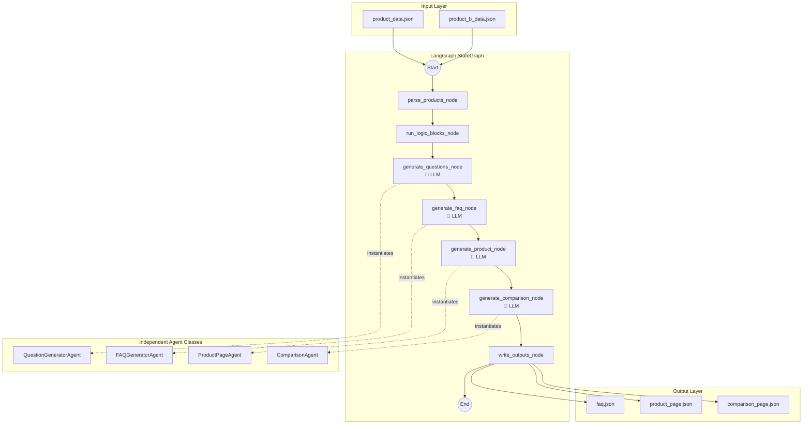
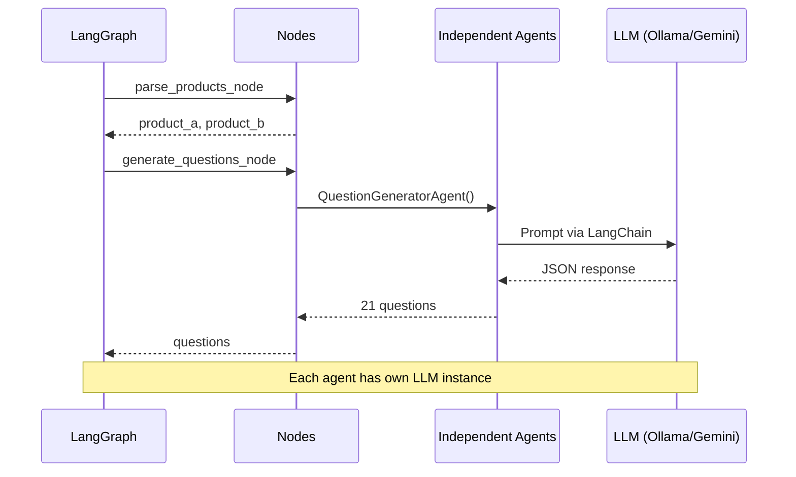

# Multi-Agent Content Generation System

## Problem Statement

Design and implement a modular agentic automation system using **LangGraph** that takes a product dataset and automatically generates structured, machine-readable content pages including FAQ, Product Description, and Comparison pages.

## Solution Overview

A **LangGraph StateGraph-powered multi-agent system** with **real LLM API calls** for content generation.

### Key Technologies

| Component | Technology |
|-----------|------------|
| Framework | **LangGraph** (StateGraph) |
| LLM Providers | Ollama (local), Gemini, OpenAI |
| Backend | FastAPI |
| Frontend | Vanilla HTML/CSS/JS |
| State Management | TypedDict |
| Output Parsing | Pydantic + JsonOutputParser |

## System Architecture



## Agent Independence

Each agent in `agents/llm_agents.py` is a **self-contained class** that:

1. Has its **own LLM instance** (not shared)
2. Defines its **own system prompt**
3. Can **run independently** without the orchestrator
4. Makes **real LLM API calls**

```python
class QuestionGeneratorAgent(BaseAgent):
    def __init__(self):
        super().__init__("QuestionGeneratorAgent")
        # Gets own LLM via get_llm() factory
    
    def get_system_prompt(self) -> str:
        return """You are a product content expert..."""
    
    def run(self, input_data: Dict) -> Dict:
        chain = prompt | self.llm | JsonOutputParser()
        return chain.invoke(input_data)
```

## LangGraph Execution Flow



## Project Structure

```
kasparro-agentic/
├── agents/
│   ├── llm_agents.py     # Independent agent classes
│   ├── nodes.py          # LangGraph node functions
│   └── graph.py          # LangGraph StateGraph
├── core/
│   ├── graph_state.py    # TypedDict state
│   ├── llm_factory.py    # Multi-provider LLM factory
│   └── schemas.py        # Pydantic output schemas
├── api/
│   └── main.py           # FastAPI REST API
├── frontend/
│   ├── index.html
│   ├── styles.css
│   └── app.js            # Dynamic loading (no hardcoded fallbacks)
├── output/               # LLM-generated JSON
├── pyproject.toml        # Proper Python package
└── requirements.txt
```

## Output Structure

All outputs are **LLM-generated** JSON:

- `faq.json` - 20+ Q&A pairs generated by FAQGeneratorAgent
- `product_page.json` - Product description by ProductPageAgent
- `comparison_page.json` - A vs B comparison by ComparisonAgent
