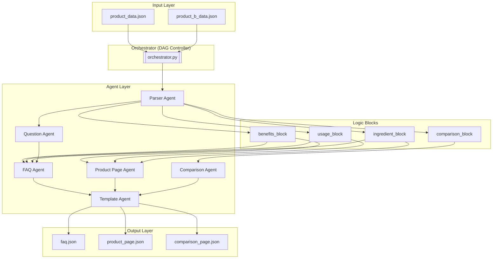
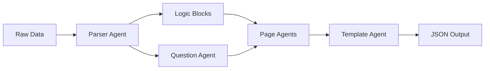

# Multi-Agent Content Generation System

## Problem Statement

Design and implement a modular agentic automation system that takes a product dataset and automatically generates structured, machine-readable content pages including FAQ, Product Description, and Comparison pages.

## Solution Overview

A **DAG-based multi-agent system** with an orchestrator controlling specialized worker agents. The system follows these principles:

- **Single Responsibility**: Each agent handles one specific task
- **Pure Functions**: Logic blocks are stateless transformations
- **Deterministic Output**: Same input always produces same output
- **No Hallucination**: All content derives from provided data

## Scopes & Assumptions

### In Scope
- Single product dataset processing (GlowBoost Vitamin C Serum)
- Fictional Product B for comparison (ClearGlow Niacinamide Serum)
- 3 output pages: FAQ, Product Description, Comparison
- Rule-based content generation (no LLM/AI dependencies)

### Assumptions
- Product data structure remains consistent
- All transformations are deterministic
- JSON is the sole output format

## System Design

### Architecture Overview



### Execution Flow (DAG)



### Agent Responsibilities

| Agent | Input | Output | Responsibility |
|-------|-------|--------|----------------|
| Parser | Raw JSON | ProductModel | Data validation & normalization |
| Question | ProductModel | 15+ Questions | Generate categorized questions |
| FAQ | Questions + Blocks | FAQ Page | Generate Q&A pairs |
| Product Page | Model + Blocks | Product Page | Generate product description |
| Comparison | A, B + Blocks | Comparison Page | Generate product comparison |
| Template | Page Data | Validated JSON | Fill templates & validate |
| Orchestrator | All | 3 JSON files | DAG execution & coordination |

### Logic Blocks (Pure Functions)

| Block | Input | Output |
|-------|-------|--------|
| `process_benefits()` | ProductModel | benefitList, count, primary |
| `process_usage()` | ProductModel | instructions, frequency, quantity |
| `process_ingredients()` | ProductModel | ingredientList, concentration |
| `compare_products()` | A, B | common, unique, price diff |

### Template System

Each template defines:
- **fields**: Required output fields
- **rules**: Validation rules (min/max length, patterns)
- **blockDependencies**: Which logic blocks provide data
- **agentDependencies**: Which agents must run before

### Running the System

```bash
python -m agents.orchestrator
```

### Output Structure

All outputs are strict JSON with `lowerCamelCase` keys:

- `output/faq.json` - Min 5 Q&As with categories
- `output/product_page.json` - Complete product information
- `output/comparison_page.json` - Structured A vs B comparison
